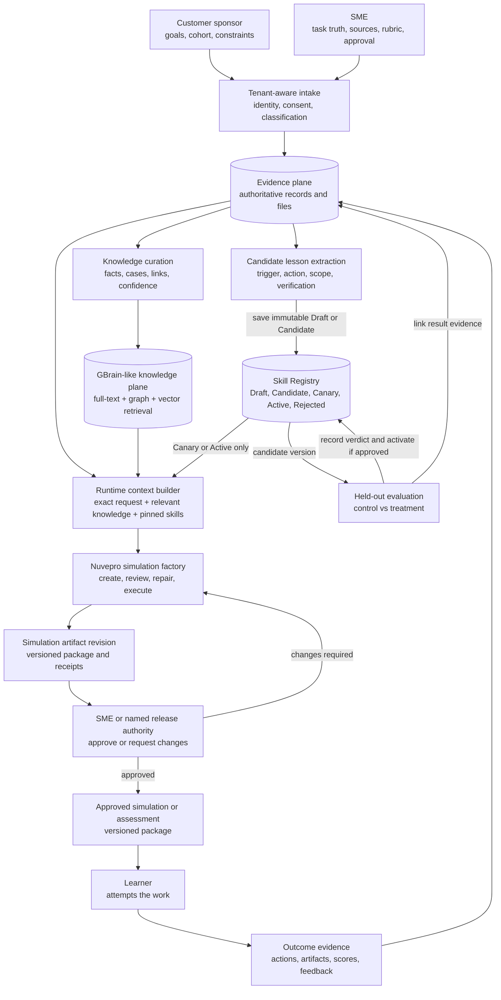

# Nuvepro Organizational Learning Handbook

**Status:** Working internal handbook

**Version:** 0.1

**Date:** 2026-08-07

**Audience:** Product, Engineering, SMEs, Learning Operations, and customer-facing teams

**Scope:** How Nuvepro captures experience, turns selected lessons into governed procedures, applies them in the simulation factory, and proves that the system improved

## Reading guide

| Reader | Recommended path |
| --- | --- |
| Everyone | Chapters 1 to 3 for the shared mental model, then Chapter 14 for current versus target state |
| Customer-facing teams | Chapters 1, 4, 5, 12, and 15 |
| SMEs and Learning Operations | Chapters 2, 4, 10, 11, 12, and 15 |
| Product and governance | Chapters 5 through 13 |
| Engineering | Chapters 6 through 11, then Chapters 13 through 15 |

The complete handbook is organized as follows:

1. Purpose and product decision
2. What it means for the system to learn
3. External procedural learning versus reinforcement learning
4. Actors and authority
5. End-to-end architecture
6. Four components and governed information domains
7. Classification, graphs, vectors, and loops
8. Framework strategy: own the core, borrow the patterns
9. Runtime retrieval and application
10. Production skill model
11. Evaluation method
12. Worked example
13. Governance and open decisions
14. Current Nuvepro state
15. Delivery roadmap and team operating model

The appendices contain anti-patterns, a glossary, frequently asked questions, and the evidence base.

## 1. Purpose

Nuvepro should become better through verified organizational experience, not through an unsupported claim that an AI model automatically learns with time.

The system improves only when a real experience causes a persistent, scoped, measurable change to later work. That requires a governed chain:

```text
capture what happened
    -> preserve evidence and context
    -> identify a possible lesson
    -> encode a future-facing procedure
    -> test it on unseen work
    -> approve and version it
    -> retrieve it for the next relevant task
    -> measure the new outcome
```

This handbook defines that chain for Nuvepro. It gives the team a common vocabulary, separates the major system responsibilities, identifies what the current factory already provides, and describes the next implementation sequence.

### How to read status labels

- **Current:** implemented or evidenced in the Nuvepro system at this handbook date.
- **Decision:** architectural direction selected for Nuvepro.
- **Target:** capability to build; it must not be presented as live.
- **Open question:** policy, ownership, or implementation choice still requiring a recorded decision.

### The central product decision

**Decision:**

The Nuvepro simulation factory remains the system authority and the instruction-applying harness. Nuvepro does not need Hermes or Pi in the production critical path to create an organizational learning system.

We should borrow useful patterns from GBrain, SkillOpt, Hermes, and Pi:

- durable external knowledge rather than hidden model-weight dependence;
- progressive skill discovery and loading;
- bounded post-run reflection;
- benchmarked skill promotion;
- versioning, provenance, expiration, and rollback.

We should implement those patterns around the existing factory, with Nuvepro's tenant boundaries, simulation contract, deterministic gates, independent review, and audit trail.

### What exists today

This snapshot prevents target architecture from being mistaken for shipped functionality. Chapter 14 contains the complete [current-versus-target assessment](#14-current-nuvepro-state).

| Status | At this handbook date |
| --- | --- |
| **Current** | The Nuvepro factory is already the domain-specific harness, with specialized seats, deterministic gates, review and repair, executable lab checks, run manifests, and audit evidence |
| **Current precursor** | Per-tenant compact lessons can be stored, injected into creator prompts, and marked Active, Stale, or Archived; this mechanism has not yet demonstrated general performance improvement |
| **Target** | A governed evidence and knowledge plane, immutable Skill Registry, Draft and Candidate lifecycle, held-out qualification, canary activation, rollback, and longitudinal outcome proof |
| **Not a current dependency** | GBrain, pgvector, Hermes, and Pi are not required by the production factory runtime |

## 2. What it means for the system to learn

People often describe learning through two questions:

1. What did I learn today?
2. What do I want to remember for tomorrow?

The second answer is often a subset and transformation of the first. A person may preserve detailed notes about an experience but carry forward only one concise change in behavior.

Nuvepro needs the same separation.

| Human activity | Nuvepro equivalent | Purpose |
| --- | --- | --- |
| Experience | Request, source, run, edit, approval, attempt, and outcome records | Preserve what actually happened |
| Notes and cases | Tenant-scoped evidence and precedent | Preserve what was learned in context |
| Habit or procedure | Versioned `SKILL.md`-like artifact | State what to do next time |
| Recall cue | Resolver using tenant, task, role, stage, and trigger | Decide when the procedure applies |
| Reality check | Held-out evaluation and production monitoring | Determine whether it helped |

Suppose several factory runs show that a senior software lab becomes shallow when the creator is framed as a generic lab architect, but produces stronger executable packages when framed as a Level 6 staff engineer.

The evidence record should preserve:

- which runs were compared;
- model, prompt, and factory versions;
- outputs, failures, repairs, and scores;
- human observations;
- possible confounders;
- confidence in the conclusion.

The future-facing skill should say:

```text
Trigger: generating solution code or tests for a senior software lab
Action: frame the creator as a Level 6 staff engineer
Scope: code-generation seats for eligible software tasks
Verification: execute the complete package in the sandbox oracle
Evidence: linked comparison and approval records
```

These artifacts describe the same lesson, but they serve different purposes. The note preserves the past. The skill changes future behavior.

## 3. What this is, and what it is not

### This is external procedural learning

The target model can remain unchanged while the surrounding system improves. Nuvepro can change which verified facts, cases, procedures, tools, and checks are supplied during a run.

Useful technical labels are:

- organizational learning system;
- non-parametric agent learning;
- experience-to-skill distillation;
- external procedural memory;
- governed inference-time adaptation.

### This is not reinforcement learning

Writing a skill, retrieving it, and adding it to a model's context does not update the model's weights. There is no learned value function, policy-gradient update, or optimization of cumulative reward. An outcome score can evaluate a skill without making the process reinforcement learning.

| Technique | What changes | Appropriate Nuvepro use |
| --- | --- | --- |
| Governed memory and skills | External facts, cases, procedures, and retrieval | Primary near-term learning architecture |
| Supervised learning | A narrow model trained on labeled examples | Retrieval ranking, defect prediction, escalation classification, or preference scoring after enough labels exist |
| Contextual bandit | Selection policy among reversible approved options | Later selection among approved prompts, skills, models, or review depths |
| Reinforcement learning | A sequential policy learned from reward | Later use for bounded, high-volume, automatically verifiable problems |

Possible later RL applications include sandbox provisioning, tool sequencing, reversible resource routing, or bounded scenario-agent behavior. RL is not the first mechanism for company facts, SME corrections, policy, simulation quality, or learner development. Those signals are delayed, sparse, confounded, and vulnerable to reward hacking.

## 4. The people and organizations interacting with the system

Nuvepro has one customer entity and at least three external human roles.

### Customer and sponsor

The **customer** is the enterprise or tenant. The **customer sponsor** is the person acting for that organization. A sponsor may be a technical leader, transformation leader, people manager, learning leader, or program owner.

The sponsor defines why the initiative exists:

- transformation goal;
- target population and cohorts;
- desired role or task changes;
- constraints, timing, tools, and policies;
- success criteria;
- approval authority.

### Subject Matter Expert

The SME may work for Nuvepro or for the customer. The SME supplies or validates domain truth:

- real tasks and decisions;
- source documents and examples;
- job context and constraints;
- expected evidence of competence;
- rubrics, answer keys, and exceptions;
- corrections and approval decisions.

### Learner

The learner performs the simulation or assessment. The learner produces a different class of evidence:

- actions and decisions;
- submitted artifacts;
- tool usage;
- scores and rubric evidence;
- requests for help;
- misconceptions and recurring errors;
- feedback about realism and usability;
- later performance evidence where collection is permitted.

One person may hold more than one role. The system must record the role under which each action was performed, not infer authority from identity alone.

### Nuvepro governor or operator

The external actors supply intent, truth, approvals, and outcomes. Nuvepro also needs an internal control role. The governor or operator is accountable for the safe operation of the learning loop:

- reviews candidate provenance and scope;
- owns or routes unresolved conflicts;
- starts and monitors evaluations and canaries;
- responds to alerts and executes rollback;
- manages stale, superseded, and archived states;
- confirms that required human approvals exist;
- preserves operational and evaluation receipts.

This may be a role shared across Product, Engineering, Learning Operations, and governance rather than one permanent job title. Automation can enforce gates, but a named human owner remains accountable for high-impact activation.

### Inputs are evidence, not immediate behavioral instructions

Information from sponsors, SMEs, learners, and factory runs enters the evidence layer first. It does not automatically become reusable knowledge or an active skill.

This prevents three dangerous shortcuts:

- treating an unverified SME comment as a global rule;
- treating one learner failure as proof that every future learner needs the same intervention;
- treating one customer's confidential practice as reusable across tenants.

## 5. The end-to-end architecture

**Target:**

The dominant story is a request becoming a verified simulation, then producing evidence that can improve a later request.

### Executive overview


*Figure 1. Nuvepro's governed organizational-learning loop, informed by SkillOpt. SkillOpt contributes the external-skill optimization pattern; the Nuvepro factory remains the application and governance authority.*

### Detailed system flow



The diagram contains two loops with different responsibilities:

- The governed run loop creates, reviews, repairs, executes, and publishes one simulation package.
- The cross-run learning loop converts accumulated evidence into a candidate behavioral change and evaluates it before future use.

Keeping these loops separate makes causality and governance visible. Local repair improves the artifact in the current run. Skill promotion changes later runs.

## 6. The four components of the learning system

**Decision:**

The architecture can be summarized as four product components.

| Component | Core question | Nuvepro implementation |
| --- | --- | --- |
| 1. Procedural skill | What should the system do differently next time? | Versioned `SKILL.md`-like content plus structured trigger, scope, guardrails, and evidence |
| 2. Storage and retrieval | What prior evidence and knowledge are relevant now? | Tenant evidence store, GBrain-like knowledge service, graph, full-text and vector retrieval |
| 3. Application layer | How is the instruction applied safely? | Nuvepro factory, context builder, model seats, tools, contracts, reviewers, and execution oracle |
| 4. Evaluation method | Did the change improve the system? | Frozen control, held-out tasks, independent checks, human approval, canary, monitoring, and rollback |

All four are required.

- A stored skill without retrieval is forgotten.
- A retrieved skill without application changes nothing.
- An applied skill without evaluation may make performance worse.
- An evaluation without durable promotion cannot improve the next run.

### Storage and retrieval contains three sublayers

The second component should not be interpreted as one undifferentiated vector store.

| Sublayer | Responsibility | Typical mechanism |
| --- | --- | --- |
| Authoritative evidence | Preserve exact requests, sources, decisions, attempts, outcomes, and files | Tenant database, immutable receipts, and object storage |
| Curated knowledge and cases | Preserve facts, precedents, summaries, relationships, confidence, and provenance | Versioned pages and structured relational or graph records |
| Indexes and resolver | Find eligible context and approved skills for a run | Exact filters, graph traversal, full-text search, vector search, reranking, and code-enforced triggers |

The indexes are derived access paths. They are not the authoritative record. The resolver uses them after permissions and scope are established.

### The four governed information domains

The four components above describe capabilities. The following four planes describe where information and responsibility live.

They are related but not interchangeable. Storage and retrieval operate across the Evidence, Knowledge, and Skills planes. The factory is the primary Execution plane. Evaluation is a cross-plane governance loop that checks retrieval, application, and outcome evidence before changing the active Skill plane.

| Plane | What belongs there | Recommended storage | What must not happen |
| --- | --- | --- | --- |
| Evidence | Requests, sources, files, actor decisions, edits, approvals, runs, attempts, scores, and outcomes | Tenant-scoped transactional records plus object storage for files | Raw input must not become an active rule automatically |
| Knowledge | Curated facts, terminology, cases, precedents, relationships, summaries, confidence, and provenance | GBrain-like service backed by relational, full-text, graph, and vector indexes | Similarity must not override authority, version, or permissions |
| Skills | Approved future-facing procedures with triggers, scope, compatibility, tests, and lifecycle | Versioned Skill Registry, rendered or exported as Markdown | A semantic match must not activate an unapproved skill |
| Execution | Context packages, factory runs, model and tool calls, deterministic checks, reviews, repairs, costs, and receipts | Task Ledger, audit store, run manifests, artifact store | An agent must not become the durable source of truth |

These planes may initially share physical infrastructure, whether that is the current tenant stores or a later PostgreSQL service, but they should not share lifecycle rules or access semantics. Logical separation matters before physical separation.

#### Where `SKILL.md` is stored

There are two meanings of `SKILL.md` in the Nuvepro environment.

1. Development-agent skills live as files under `.agents/skills`. They guide Codex and other development agents. Git versions them.
2. Production factory skills should live in a governed Skill Registry. Their instructional body can be Markdown, but their trigger, scope, compatibility, approval, evaluation, and rollback data should be structured fields.

The Markdown is a reviewable representation, not the complete production control plane.

A production registry can begin with relational tables such as:

```text
skill_definitions
skill_versions
skill_scopes
skill_evaluations
skill_activations
```

It does not initially require a separate physical database. It does require separate authorization, lifecycle, and activation logic from ordinary notes.

## 7. Classification, graphs, vectors, and loops

These terms solve different problems and should not be collapsed into one database feature.

### Classification comes before embedding

Classification determines what an item is and how it may be used:

- tenant and program;
- source actor and role;
- goal, constraint, task, source, rubric, attempt, outcome, or lesson;
- role family, task family, simulation, and cohort;
- sensitivity and retention class;
- approval and confidence state;
- tenant-only or eligible for broader reuse.

Rules, structured forms, and models may assist classification. pgvector does not perform this function.

An embedding model turns eligible content into vectors. pgvector stores and compares those vectors. It helps retrieve semantically similar items, but it does not establish truth, scope, authority, or approval.

### Graph engineering

Graph engineering defines the entities and relationships that let the team trace why something exists and where it may apply.

The minimum identity spine is:

```text
tenant
  -> transformation request
  -> program and cohort
  -> role and task
  -> simulation project
  -> artifact revision
  -> approval decision
  -> learner assignment
  -> learner attempt
  -> outcome
```

Other important edges include:

```text
candidate skill -> derived from -> evidence records
candidate skill -> evaluated by -> evaluation receipt
active skill -> compatible with -> factory and model versions
factory run -> used -> knowledge and skill versions
finding -> repaired by -> artifact revision
precedent -> applies to -> tenant, role, task, and constraints
```

The graph supports lineage, permission scoping, impact analysis, and deterministic neighborhood retrieval. Authorization remains code-enforced. A vector index provides semantic recall. Neither replaces the other.

### Loop engineering

Loop engineering defines how state changes over time, who can authorize that change, and how the system returns to a safe state.

Nuvepro has three important loops:

| Loop | Time horizon | State change |
| --- | --- | --- |
| Factory production loop | Within one run | Draft becomes a reviewed, executable simulation package |
| Organizational learning loop | Across runs | Evidence becomes approved knowledge or a validated skill |
| Learner development loop | Across attempts | Learner evidence changes feedback, assignment, or development plan |

A loop is incomplete without a trigger, terminal condition, evidence receipt, escalation path, and rollback or recovery rule.

## 8. Own the Core, Borrow the Patterns

**Decision:**

GBrain, SkillOpt, Hermes, and Pi offer useful patterns, but they sit at different layers. SkillOpt is the framework reference for optimizing and qualifying skills. SkillLens is research evidence, not the framework selected for this architecture.

| System or convention | Responsibility | Nuvepro decision |
| --- | --- | --- |
| GBrain | Durable pages, versions, links, graph, full-text and vector retrieval, synthesis, and corpus maintenance | Use as an architectural reference for the knowledge plane; do not treat it as the entire product memory |
| SkillOpt | Evaluation-driven optimization of external skill documents through proposed edits, benchmark runs, measured selection, and retained versions | Borrow the optimization and promotion discipline; implement it through Nuvepro's Skill Registry and evaluation harness |
| `SKILL.md` | Portable human-readable procedural instruction | Use as an interchange and review format backed by structured production records |
| Pi | General-purpose harness with progressive skill discovery and loading | Borrow the thin-harness and progressive-loading pattern where useful |
| Hermes | General-purpose agent runtime with tools, memory, skills, and background reflection | Borrow provider abstraction, memory lifecycle, and bounded reflection patterns where useful |
| Nuvepro factory | Domain-specific simulation compiler and governance boundary | Keep as the production application layer and authority |

GBrain is not built on Hermes. It is a separate knowledge service that can be consumed by different harnesses. Hermes and Pi do not supply Nuvepro's simulation package contract, tenant governance, deterministic lint, answer-key separation, bounded repair, or independent review graph.

The current Nuvepro runtime does not depend on GBrain or pgvector. The proposed knowledge plane may adopt GBrain directly, adapt its pattern, or implement equivalent capabilities. That choice should follow tenant isolation, operational reliability, and integration requirements.

**Current:** Nuvepro uses per-tenant SQLite operational stores and LanceDB for the external task corpus. There is no product GBrain or pgvector integration in the factory runtime.

**Open question:** Whether the target knowledge plane uses GBrain itself, a Nuvepro implementation of the same pattern, or another managed PostgreSQL and retrieval service remains undecided.

### Three implementation strategies

| Strategy | Advantage | Risk | Decision |
| --- | --- | --- | --- |
| A. Use an external framework as the product core | Fast access to existing memory, skill, tool, or retrieval features | Nuvepro semantics become constrained by another project's lifecycle, tenancy, schema, and release path | Do not choose as the default architecture |
| B. Build every layer ourselves | Maximum direct control | Rebuilds commodity infrastructure, increases maintenance, and delays product learning | Do not choose |
| C. Own the Nuvepro domain core and connect replaceable adapters | Preserves product semantics while using mature infrastructure underneath | Requires disciplined contracts and adapter tests | Recommended |

Adopting GBrain as a replaceable knowledge subsystem behind a Nuvepro-owned interface is Strategy C, not Strategy A. Strategy A means surrendering Nuvepro's canonical semantics, lifecycle, or product authority to an external framework.

Nuvepro should own the parts that express the product's meaning and trust boundary:

- evidence, case, skill, evaluation, and approval schemas;
- common identity spine;
- factory graph and state transitions;
- runtime context-pack contract;
- tenant, identity, authorization, and data-rights boundaries;
- skill lifecycle, composition, precedence, compatibility, and rollback;
- run, evaluation, and publication manifests.

Commodity or replaceable capabilities can remain behind adapters:

- SQL engine;
- vector index such as LanceDB or pgvector;
- full-text index;
- object storage;
- embedding and model providers;
- container execution runtime;
- a replaceable knowledge service, including a possible GBrain adapter.

Hermes, Pi, or other general harness connectors may be useful for experiments or interoperability, but they should remain outside the production authority path unless a later, measured use case justifies them.

Nuvepro has already borrowed parts of this philosophy: a domain-specific factory, bounded creator-only lesson injection, specialized creator and reviewer roles, independent execution and review, and Active, Stale, and Archived lesson states.

Custom does not mean rebuilding PostgreSQL, vector search, container runtimes, or model gateways. It means that Nuvepro owns the canonical semantics and can replace the infrastructure that implements them.

### Durable formats are boundaries, not the whole system

Open, inspectable formats reduce lock-in, but a file format alone does not provide lifecycle, permissions, retrieval, or evaluation.

| Asset | Durable representation | Nuvepro-owned control around it |
| --- | --- | --- |
| Customer and SME sources | Original PDF, document, media, or data file plus a content hash | Tenant, rights, sensitivity, source role, version, and provenance |
| Canonical records | Versioned relational records with documented JSON or SQL export | Entity schema, identity spine, authorization, retention, and deletion |
| Procedural instruction | Markdown, including a `SKILL.md`-compatible rendering | Trigger, exclusions, scope, approval, compatibility, evaluation, activation, and rollback |
| Simulation package and evidence | Portable artifacts plus a manifest and hashes | Package contract, learner-safe separation, execution result, and publication approval |
| Search index | Rebuildable full-text, graph, and vector structures | Eligibility filters, ranking policy, evaluation, and deterministic rebuild |

A PDF can preserve what an SME supplied, but it does not say whether the content is current, authoritative, or reusable. Markdown can make a skill portable and reviewable, but it does not decide whether the skill is approved or applicable. The Nuvepro-owned records and contracts provide that meaning.

### Adoption test for an external component

Before adding a framework or service to the critical path, score it against:

1. **Product-semantic fit:** Can it express Nuvepro's entities, states, approvals, and evidence without distortion?
2. **Replaceability and export:** Can all canonical data and configuration leave in documented portable formats?
3. **Security and tenancy:** Can permissions, isolation, audit, deletion, and data residency be enforced?
4. **Operability:** Can Nuvepro monitor, back up, restore, scale, and troubleshoot it?
5. **Maintenance and community:** Is the release path, security response, and project health acceptable?
6. **Measured time saved:** Does adoption reduce delivery or operating effort after integration and migration costs?

### Exit strategy is part of adoption

Every replaceable component should have:

- a narrow adapter boundary owned by Nuvepro;
- canonical portable records, such as JSON, Markdown, SQL exports, and object manifests;
- pinned versions and recorded compatibility;
- contract tests that alternative implementations must pass;
- complete data export plus deterministic index rebuild;
- a documented degraded-mode or fallback path;
- migration tests before the component becomes a critical dependency.

## 9. Runtime retrieval and application

**Target:**

The factory should assemble a temporary, reproducible context package for every run. Agents should not own durable memory.

### Retrieval sequence

1. Resolve actor identity, tenant, program, and permissions.
2. Fetch the current request, cohort, constraints, sources, and approvals by exact IDs and versions.
3. Classify the requested work into role, task, artifact, and factory-stage dimensions.
4. Retrieve knowledge only after tenant, privacy, lifecycle, and authority filters are applied.
5. Combine exact metadata filters, graph-neighbor traversal, full-text search, and vector similarity.
6. Rerank results for relevance, recency, authority, and evidence quality.
7. Select skills only from approved or canary versions compatible with the tenant, task, stage, and factory version.
8. Apply explicit trigger and exclusion rules. Semantic similarity may rank eligible skills, but it cannot make an ineligible skill active.
9. Pin exact knowledge and skill versions in the run manifest.
10. Inject the minimum necessary material into the correct factory seats.

The resulting context package is:

```text
exact approved customer request
+ exact cohort, role, task, constraints, and source versions
+ relevant tenant knowledge and approved precedents
+ approved and pinned procedural skills
+ tools, execution policy, and artifact contract
= reproducible context for one factory run
```

### Instruction precedence

When sources conflict, the factory should apply a fixed precedence:

1. platform safety, privacy, and security policy;
2. tenant contract and factory charter;
3. current approved request, source, and rubric;
4. approved scoped skill;
5. retrieved knowledge, case, or precedent;
6. model inference.

The charter wins over learned material. A skill is bounded advice, not permission to override current customer truth or platform policy.

### Creator and judge separation

Skills intended to change creation should be injected only into the applicable creator. They should not be supplied to the judge that evaluates whether the result improved. The current factory follows this principle for learned lessons.

The run receipt should record:

- exact request and source versions;
- retrieved knowledge IDs and scores;
- skill IDs, versions, triggers, and application seats;
- model, provider, prompt, tool, and factory versions;
- deterministic results, reviewer findings, repairs, timing, and cost;
- published artifact version and approval state.

## 10. The production skill model

**Target:**

A skill is a governed behavioral artifact, not a good-sounding paragraph.

### Minimum skill contract

| Field | Purpose |
| --- | --- |
| Identity and immutable version | Reproduce exactly what influenced a run |
| Claim | State the outcome or behavior expected to improve |
| Trigger | Define when it should load |
| Exclusions | Define when it must not load |
| Action | Give an executable procedure or decision rule |
| Scope | Bound tenant, role, task family, artifact, seat, and stage |
| Guardrails and blacklist | State prohibited or high-risk actions |
| Verification | Define how compliance and outcome are checked |
| Provenance | Link source runs, edits, approvals, and outcomes |
| Compatibility | Pin factory, model, tool, or schema assumptions |
| Evaluation receipt | Record control, treatment, data partitions, result, and approval |
| Rollback pointer | Identify the previous approved version |

### Promotion test before evaluation

An observed lesson should become a candidate skill only when:

1. the situation is likely to recur;
2. forgetting it would cause meaningful failure or rework;
3. the lesson is supported by evidence rather than plausibility alone;
4. a concrete trigger, action, scope, and verification can be stated;
5. an instruction is more useful than retrieving the full case each time.

Otherwise it should remain a searchable note or precedent.

### Lifecycle

| State | Meaning |
| --- | --- |
| Draft | A human or reflector has recorded a possible procedure |
| Candidate | Scope, trigger, provenance, and evaluation contract are complete |
| Evaluated | Held-out results and reviewer evidence exist |
| Rejected | Evidence shows harm, duplication, invalidity, or insufficient support |
| Canary | Approved for limited declared exposure |
| Active | Approved for normal use within its exact scope |
| Stale | Needs revalidation because of age, dependency change, or weak recent use |
| Superseded | A later approved version replaces it |
| Rolled back | Production evidence breached a guardrail |
| Archived | Retained for audit but unavailable for retrieval |

New reflector output should enter as Draft, not Active. Failed candidates and rejected edits should remain available to the evaluation and governance layer so the team does not repeat the same experiment without realizing it.

### Composition and conflict

Loading many individually useful skills can still create a bad combined context. The resolver should therefore:

- cap the number and token budget;
- prefer narrow, high-authority skills;
- detect mutually exclusive instructions;
- apply precedence and dependency rules;
- record the full skill-set hash;
- evaluate important combinations, not only isolated skills.

## 11. Evaluation method

**Target:**

Evaluation is the gate between remembering an observation and allowing it to influence production behavior.

### Evaluate three distinct questions

| Evaluation layer | Question | Example measure |
| --- | --- | --- |
| Retrieval | Did the resolver load the right skill only for the right situation? | Trigger precision, trigger recall, zero cross-tenant leakage |
| Application | Did the factory follow the loaded procedure? | Required-step adherence, prohibited-action rate, trace evidence |
| Outcome | Did following it improve the result? | First-pass acceptable package rate, serious-defect rate |

A good skill can appear ineffective when retrieval misses it. A harmful skill can appear harmless when a creator ignores it. Qualification should first inject a candidate deliberately into eligible treatment runs to isolate procedural utility. Retrieval should be tested separately on labeled load and do-not-load cases. Canary operation then tests the full system.

### Keep four evidence partitions separate

| Partition | Use | May decide promotion? |
| --- | --- | --- |
| Discovery evidence | Experiences from which the lesson was inferred | No |
| Development set | Examples used to refine wording and scope | No |
| Sealed qualification set | Unseen tasks used for the final comparison | Yes |
| Production canary stream | New eligible cases after provisional approval | Yes, for continued activation or rollback |

Near-duplicates and cases derived from the same source template should remain in one partition. For platform-wide claims, hold out entire tenants where possible. A tenant-scoped skill may instead use task-family-separated and time-separated holdouts within that tenant. The declared claim determines the correct unit of separation.

### Paired control and treatment

The evaluation comparison is:

> Control: current factory plus the current approved skill set
>
> Treatment: the exact same factory plus the current approved skill set plus one candidate skill

For each sealed task:

- freeze the factory commit, models, prompts, tools, environment, data, and budgets;
- randomize arm order and blind reviewers to arm identity;
- repeat runs because model outputs are stochastic;
- compare at the distinct-task level;
- invalidate and report provider substitutions, missing execution, or incomplete receipts separately;
- change only one meaningful variable.

Three repetitions per arm can support an early pilot, but distinct unseen tasks matter more than many repetitions of the same task. A small experiment may falsify a harmful idea. It cannot prove product-wide generality.

### Scoring order

1. **Safety and scope:** zero critical policy, privacy, security, cross-tenant, or wrong-scope failures.
2. **Deterministic correctness:** schema, contract, required files, execution, outputs, provenance, and reproducibility.
3. **Independent quality judgment:** a judge that did not create the output and does not receive creator-only skills.
4. **Human and downstream impact:** blinded approval, editing, escalation, learner evidence, and later work outcomes.

The recommended primary metric is:

> First-pass acceptable package rate: the percentage of distinct held-out tasks that pass every hard validator and receive an independent accept verdict without a repair round.

Guardrails should include:

- critical and serious defect rates;
- `solvesProblem` and `testsSound` pass rates for labs;
- deterministic contract and execution pass rate;
- repair rounds and model calls;
- elapsed time and cost per accepted package;
- human review time, edits, escalations, and overrides;
- retrieval precision and recall;
- learner or business outcome measures when available and valid.

Do not collapse these into one reward score. An average improvement must never compensate for a critical safety or tenant-isolation failure.

### Keep three outcome horizons separate

| Outcome loop | Question | Typical evidence | Typical horizon |
| --- | --- | --- | --- |
| Factory outcome | Did Nuvepro create a valid, useful, first-pass acceptable package? | Execution, defects, reviewer approval, edit distance, time, and cost | Minutes to days |
| Learner outcome | Did the person demonstrate or develop the intended capability? | Attempts, rubric evidence, progression, transfer task, and retention check | Days to months |
| Business outcome | Did the target work or team performance change? | Agreed operational measures, manager evidence, quality, throughput, risk, or adoption | Weeks to quarters |

These loops may be linked by the common identity spine, but they are not interchangeable. Factory acceptance is not proof of learning. Learner improvement is not automatically proof of business change. Business movement without a valid comparison is not automatically attributable to Nuvepro.

### Promotion and canary decision

A candidate can enter canary only when:

- its provenance and scope are valid;
- there are no new critical failures;
- the predeclared primary target is met, or a declared efficiency skill meets its quality non-inferiority bound;
- guardrails remain within limits;
- independent human approval is recorded;
- the exact version and rollback pointer are stored.

Begin with shadow evaluation where possible. Then limit exposure by tenant, task family, factory seat, or a small percentage of eligible runs. Keep a continuing control sample.

Immediate rollback conditions include:

- any critical safety, policy, privacy, or cross-tenant failure;
- retrieval outside declared scope;
- a deterministic regression on work the control completes;
- repeated serious-defect deterioration;
- cost, latency, or human escalation beyond the declared limit without the expected quality gain.

### Longitudinal system evaluation

Candidate-skill qualification asks whether one proposed change helps. Longitudinal evaluation asks whether the complete learned system is better than its starting point.

For a Day 1 versus Day N claim:

1. freeze the foundation model, prompts, and Day 1 system snapshot;
2. create a blinded, contamination-free challenge set;
3. save later snapshots after defined counts of verified cases, not calendar days alone;
4. replay the same challenge set through both snapshots;
5. measure first-pass approval, serious defects, edit distance, review time, policy compliance, and task success;
6. run ablations for retrieval, precedents, skills, learned rankers, and routing;
7. report sample sizes and uncertainty.

An improvement caused by switching to a stronger foundation model is valuable product progress, but it is not proof of organizational learning.

## 12. Worked example: an incident-response transformation

**Target:** This is an illustrative end-to-end workflow, not a claim that every step is live today.

### 1. Sponsor request

A customer sponsor asks Nuvepro to help a cloud operations team improve incident diagnosis. The sponsor identifies the cohort, approved tools, data restrictions, expected operating behavior, and success criteria.

The exact request and its approved version enter the Evidence plane. It is never recovered through vector similarity.

### 2. SME grounding

An authorized SME supplies representative incident material, identifies the real decisions engineers make, defines unacceptable shortcuts, and approves a rubric. Source files, comments, and approval conditions remain linked to the request and task IDs.

### 3. Knowledge retrieval

The context builder retrieves tenant-eligible facts and approved precedents such as customer terminology, prior incident patterns, tooling constraints, and a similar simulation that the same customer previously approved.

Permissions and metadata filter first. Graph links and semantic retrieval then help rank the eligible cases. Every result retains its source and version.

### 4. Skill retrieval

The resolver finds an active procedure whose trigger matches this factory stage:

```text
Trigger: authoring a senior incident-diagnosis simulation
Action: require the learner to establish evidence and compare hypotheses before remediation
Exclusions: junior procedural drills and tasks without observable diagnostic evidence
Verification: rubric and tests must distinguish diagnosis from lucky remediation
```

The skill's exact version is pinned. It does not override the current request or SME-approved constraints.

### 5. Factory application

The Nuvepro factory receives the exact request, grounded sources, retrieved precedents, pinned skill, tools, and artifact contract. Creator seats build the simulation and lab. Deterministic checks enforce contracts, an independent reviewer judges quality, and the execution oracle verifies the package.

The run manifest records every input, model, skill, finding, repair, execution result, time, and cost.

### 6. Approval and learner use

The SME or named release authority approves a specific artifact revision, possibly with conditions. Learners receive only learner-safe materials, perform the simulation, and produce attempt evidence. Hidden answer keys remain outside the learner surface.

### 7. Learning proposal

Across several cases, the system may observe that simulations requiring evidence before remediation have higher rubric discrimination and need fewer SME corrections. A reflector proposes a lesson, but it enters as Draft.

The evidence record preserves all source runs and confounders. The candidate procedure records a trigger, exclusions, action, verification, scope, and compatibility.

### 8. Evaluation and activation

The candidate is tested on sealed incident-response tasks that did not produce it. The control uses the current approved skill set. The treatment adds only the candidate. Both arms use the same factory, models, prompts, tools, and budgets.

If the candidate improves first-pass acceptable package rate without a hard regression, a governor may authorize a tenant-scoped canary. If live results remain within guardrails, the exact version becomes Active. If not, the resolver returns to the previous approved version.

### Artifact placement in the example

| Artifact | Plane |
| --- | --- |
| Sponsor request, SME sources, approvals, learner attempts, and outcomes | Evidence |
| Customer terminology, incident cases, and approved precedent | Knowledge |
| Evidence-before-remediation procedure and its versions | Skills |
| Context package, factory run, tests, findings, and receipts | Execution |

The example shows why storing information is not enough. The system improves only when exact evidence, curated knowledge, an evaluated skill, and the factory's application controls work together.

## 13. Governance, decisions, and open questions

**Decision:**

### Non-negotiable controls

- Tenant isolation applies before retrieval, not after generation.
- Every reusable item retains provenance to authoritative evidence.
- Raw files and records remain available independently of their embeddings.
- Human edits must preserve the before version, after version, actor, reason, timestamp, and content hash.
- High-impact facts and skills require explicit approval.
- Learner data is collected only for declared purposes with appropriate retention and access controls.
- Cross-tenant reuse requires explicit policy, rights, de-identification where necessary, and a separate global approval path.
- A model may propose a memory or skill. It may not be the sole authority that activates its own proposal.
- Creator and judge independence must be preserved.
- Deletion, expiration, supersession, and rollback are first-class operations.
- Every run must be reproducible from its pinned inputs or clearly marked when an external dependency prevents reproduction.

### Decision-rights matrix

| Decision | Accountable role | Required evidence |
| --- | --- | --- |
| Transformation goal and success criteria | Customer sponsor | Approved request and cohort definition |
| Domain correctness | Authorized SME | Sources, task evidence, rubric, and signed decision |
| Simulation release | Named customer or Nuvepro approver | Complete package, findings, execution result, and conditions |
| Candidate skill creation | Factory reflector, SME, Product, or Engineering | Linked evidence and complete candidate contract |
| Skill qualification | Evaluation owner | Sealed benchmark receipt and independent review |
| Skill activation | Designated product or governance authority | Passed qualification, canary scope, and rollback pointer |
| Cross-tenant promotion | Data governance and product authority | Rights, de-identification, generality evidence, and global evaluation |
| Production rollback | Automated guardrail or authorized operator | Breach receipt and prior approved version |

### Decisions and open questions

**Open question:**

This handbook makes several architecture decisions, but it does not pretend that every product and governance policy has been settled. Open questions must be resolved through named owners and recorded decision artifacts before broad production activation.

#### Decisions already made

- The Nuvepro factory remains the product-specific harness and production authority.
- Organizational learning lives in governed external state and can survive model replacement.
- Evidence, Knowledge, Skills, and Execution remain logically distinct.
- The current approved request is fetched exactly. Vector search is used only for eligible contextual recall.
- Production skills require a Skill Registry, even when Markdown is their review format.
- In the target lifecycle, reflected lessons begin as Draft proposals. Held-out evaluation governs activation.
- Creator instructions remain hidden from independent judges.
- Tenant isolation, provenance, version pinning, monitoring, and rollback are mandatory.
- Factory quality, learner development, and business transformation are separate outcome loops.
- GBrain, Hermes, Pi, pgvector, and RL are options or references, not substitutes for the Nuvepro product contract.

#### Open decisions

The safeguards below are conservative interim defaults, not final policy decisions.

| Open question | Why it matters | Interim safeguard until decided | Decision owner and artifact needed |
| --- | --- | --- | --- |
| Who prevails when a sponsor goal, SME judgment, evaluation result, and active skill disagree? | These sources have authority over different parts of the work and cannot be reduced to one confidence score | Safety and contract remain highest. The current approved request outranks reusable memory. A direct sponsor and SME conflict pauses publication and escalates. Evaluation evidence may challenge a skill but may not rewrite customer facts | Product, Customer Success, domain governance, and Legal approve an authority and escalation matrix |
| What may be reused across tenants? | Reuse may create value but can violate confidentiality, ownership, privacy, or context boundaries | Default to tenant-only. No item enters a global corpus without explicit rights, de-identification where required, applicability evidence, and separate approval | Data governance policy plus contractual language and a global-promotion workflow |
| How do learner consent, retention, access, correction, and deletion work? | Attempts and behavioral traces may be personal data and may contribute to derived artifacts | Collect only declared data. Link derivatives to source IDs. Support tenant-scoped access and deletion review. Do not promote learner-derived rules until deletion propagation is defined | Privacy, Legal, Security, and Product approve the learner-data lifecycle and derivative-deletion policy |
| How are skill conflicts, precedence, expiry, and staleness resolved? | Multiple valid skills can conflict or become wrong after a tool, policy, model, or task changes | Use narrow scope, explicit precedence, token caps, compatibility pins, conflict detection, and fail closed on unresolved high-impact conflicts | Engineering and evaluation owners approve a composition policy, stale triggers, and revalidation schedule |
| How does a new tenant start before tenant-specific evidence exists? | Cold-start behavior must be useful without pretending that platform knowledge is customer knowledge | Use approved global templates, explicit customer sources, and human-authored procedures labeled as bootstrap material. Never describe them as tenant learning | Product and SMEs define bootstrap packs and the evidence threshold for tenant-specific promotion |
| What happens when retrieval or a model provider fails? | Silent substitution can change behavior and invalidate comparisons | Preserve exact authoritative inputs. Omit optional memory if safely possible. Fail closed when required context or policy cannot be retrieved. Record provider substitution as degraded and exclude it from primary comparisons | Engineering and SRE define fallback tiers, degraded-mode UX, retry limits, and incident policy |
| Which skills must be requalified after a model, prompt, tool, schema, or factory upgrade? | Skill utility is consumer and harness dependent | Mark affected compatibility bindings stale. Block high-impact skills until requalified. Use a sampled regression suite only where risk policy permits | Evaluation and Engineering define a dependency-impact matrix and release gate |
| How are factory, learner, and business outcomes connected without conflating them? | A technically valid lab can still fail to develop capability, and learner improvement may not produce business change | Maintain three scorecards and causal links. Do not use one as a proxy for another in external claims | Product, Learning Science, Analytics, and customer sponsors define outcome contracts and attribution limits |
| Who operates the candidate queue, canaries, alerts, and rollbacks? | A governance workflow without accountable operators will stall or fail during incidents | Require a named owner for every candidate and canary. Automated rollback handles critical guardrails. No unattended high-impact canary | Operating model with service ownership, response times, approval coverage, and escalation contacts |
| What are the cost, latency, context, and evaluation budgets? | Unbounded retrieval and evaluation can erase operational value or degrade user experience | Set per-run caps, context budgets, timeouts, evaluation quotas, and a maximum canary exposure in configuration | Product and Engineering approve service-level objectives and budget policy from measured baselines |
| Who owns the common identity spine and canonical schema? | Every evidence, knowledge, skill, run, approval, and outcome relationship depends on stable identifiers | Do not create parallel identifiers without a mapping. Require exact tenant, request, project, artifact revision, assignment, attempt, and outcome IDs in new records | Architecture and Data Governance approve the canonical schema, stewardship, migration, and retention model |
| What physical storage and knowledge-service topology should Nuvepro run? | Logical planes can share infrastructure, but operational burden, isolation, portability, and scale differ across SQLite, PostgreSQL, GBrain, and managed services | Preserve logical boundaries and stable service interfaces. Do not couple the factory to a product choice before an operational and security review | Architecture, Security, and SRE record the build-versus-adopt decision and migration plan |

#### The common identity spine to decide first

The schema decision should preserve this traceable chain:

```text
tenant
-> transformation request
-> program and cohort
-> role and task
-> simulation project
-> artifact revision
-> approval decision
-> learner assignment
-> learner attempt
-> outcome
```

Candidate skills, knowledge pages, factory runs, findings, and evaluation receipts should link to this spine rather than form independent islands.

## 14. Current Nuvepro state

This section describes the factory at the date of this handbook. It is not a statement that every proposed learning capability already exists.

### Current state versus target state

| Area | Current state | Target state |
| --- | --- | --- |
| Evidence | Strong run manifests, Task Ledger, audit findings, artifacts, and per-tenant operational records | One identity spine across sponsor, SME, factory, learner, and outcome evidence |
| Knowledge | No dedicated product knowledge plane; grounding is assembled from current sources and tenant operational context, with no required GBrain or pgvector runtime integration | Governed tenant knowledge and approved precedents with graph, full-text, and vector retrieval |
| Skills | Compact reflector lessons with active, stale, and archived states | Versioned Skill Registry with Draft, Candidate, evaluation, canary, compatibility, and rollback |
| Application | Mature domain-specific factory, specialized seats, deterministic gates, review, repair, and execution | Reproducible context builder with exact retrieval and pinned knowledge and skill versions |
| Evaluation | Rich receipts and comparison-runner foundations | Sealed paired experiments, retrieval and application tests, canaries, live controls, and longitudinal proof |
| Outcomes | Factory quality evidence and limited downstream linkage | Separate factory, learner, and business scorecards connected through approved causal links |

### Capabilities already present

- A domain-specific factory that assembles tenant and task context.
- Specialized creator, reviewer, learner-mentor, lab-reviewer, and reflector seats.
- Deterministic schema, lint, round-trip, contract, and artifact checks.
- An isolated Docker execution oracle for lab tests, with bounded repair, a stability rerun, and explicit degraded status when execution is unavailable or disabled.
- A Task Ledger, run manifest, audit receipts, findings, model metadata, timing, and cost evidence.
- Per-tenant SQLite operational storage and LanceDB for the external task corpus.
- Creator and judge model-family decorrelation.
- Learner-safe artifact separation from hidden answer keys.
- Per-tenant reflector lessons with provenance, creator-only injection, and a 240-character lesson limit.
- Bounded lesson injection and an existing active, stale, and archived lifecycle. New reflector lessons currently enter directly as Active.
- A multi-arm comparison script that provides useful foundations for a future evaluation runner.
- A relevance module that can support lesson matching, although it is not wired into the production run path.

The mechanism for storing and injecting compact lessons has been exercised. The available internal evidence does not yet prove a general performance benefit. The cited benefit evidence is n = 1, and that later run did not converge.

### Important gaps

1. A shared identity spine connecting sponsor request, SME evidence, artifact revision, approval, learner assignment, attempt, and outcome.
2. A first-class tenant evidence model for structured human edits, conditions, rejection reasons, and downstream outcomes.
3. A production GBrain-like knowledge plane with governed hybrid retrieval and source-linked precedents.
4. A versioned Skill Registry distinct from compact reflector lessons and development-agent skill files.
5. Draft and Candidate states so reflected output is not directly activated.
6. Exact retrieval and application traces tied to the run manifest.
7. Sealed benchmark manifests, paired baselines, skill-set hashes, and uncertainty reporting.
8. Canary assignment, continuing control samples, alerting, and one-step rollback.
9. A durable publication approval state tied to the exact artifact revision.
10. Learner and later work outcomes that can test effectiveness beyond factory acceptance.

The present lesson store is a useful precursor, not the complete production Skill Registry. The current runtime also has no required GBrain or pgvector dependency.

## 15. Delivery roadmap and team operating model

Each phase should ship with an explicit exit criterion. Later phases depend on earlier evidence and identity foundations.

| Phase | Build | Exit criterion |
| --- | --- | --- |
| 0. Contract and vocabulary | Canonical entities, IDs, roles, states, precedence, tenant policy, and evaluation definitions | Product, Engineering, SME, and governance owners approve one schema and glossary |
| 1. Evidence backbone | Sponsor request, SME source and decision, artifact revision, learner assignment and attempt, structured human delta, immutable receipts | One simulation can be traced from request through outcome by exact IDs |
| 2. Knowledge plane | Curated facts and precedents, provenance, graph links, hybrid retrieval, permissions, and context budget | Relevant prior cases are retrieved with citations and no cross-tenant leakage on the test suite |
| 3. Skill Registry | Versioned procedural artifacts, trigger and exclusion model, scope, compatibility, Draft and Candidate states | A candidate can be created and rendered without influencing production |
| 4. Evaluation harness | Sealed datasets, control and treatment arms, execution, blind review, task-level metrics, and immutable evaluation receipts | One real candidate receives a defensible Reject, Revise, Collect More Evidence, or Canary verdict |
| 5. Runtime activation | Resolver, pinned context package, application trace, canary assignment, alerts, and rollback | A canary skill can be activated narrowly and rolled back in one operation |
| 6. Outcome learning | Learner and approved business-outcome ingestion, longitudinal snapshots, and ablations | Nuvepro can report measured improvement after N verified cases with the same foundation model |
| 7. Selective learned optimization | Shared rankers, risk models, bandits, or constrained RL where evidence supports them | Each learned component beats a governed baseline and has a safe fallback |

### Recommended first vertical slice

Choose one customer program, one role family, and one recurring simulation type. Implement the complete chain rather than broad partial infrastructure:

```text
sponsor request
-> SME source and approval
-> factory package and execution
-> learner attempt
-> structured outcome
-> one candidate skill
-> sealed comparison
-> narrow canary or rejection
```

This slice will expose the real schema, permission, workflow, and evaluation requirements before the architecture is generalized.

### Operating guidance for each team

#### Customer-facing teams

- Separate the customer enterprise from the sponsor acting for it.
- Capture transformation goals, target population, constraints, and success criteria as versioned fields.
- Do not promise that the AI automatically learns from every interaction.
- Explain that verified experience can become approved organization-specific knowledge and procedures.
- Confirm permissions for source documents, learner evidence, reuse, retention, and de-identification.

#### SMEs

- Link every correction to the task, source, artifact revision, and reason.
- Distinguish a local exception from a recurring rule.
- State where a proposed rule applies and where it does not.
- Review complete executable artifacts, not only fluent descriptions.
- Treat a candidate skill as a hypothesis until held-out evidence supports it.

#### Product

- Define actor workflows, approvals, exceptions, and visible evidence before optimizing the intelligence layer.
- Make status and provenance understandable to non-engineers.
- Design for correction, supersession, expiry, and rollback from the beginning.
- Keep learner development outcomes separate from factory production metrics.
- Require measured claims and publish sample sizes and limitations.

#### Engineering

- Keep authoritative retrieval, semantic retrieval, skill retrieval, and context assembly as separate observable stages.
- Pin all meaningful runtime inputs and versions.
- Use code for mechanical checks and models for judgment that cannot be made deterministic.
- Preserve creator and judge independence.
- Add evaluation and rollback before enabling automatic promotion.
- Keep agents replaceable and durable state in governed services.

#### Learning and evaluation operations

- Maintain clean evidence partitions and prevent task-family leakage.
- Blind comparative reviewers to treatment identity.
- Track helped, harmed, unchanged, and invalid tasks, not only averages.
- Audit retrieval precision, skill application, and outcomes separately.
- Revalidate skills after important model, prompt, tool, schema, or policy changes.

## Appendix A: Non-negotiable anti-patterns

Nuvepro should not:

- put every raw interaction directly into a vector index and call it knowledge;
- use vector similarity as authority or permission;
- retrieve the current customer request semantically when it can be fetched exactly;
- let an agent own the only durable copy of memory;
- write one monolithic Markdown file that mixes facts, evidence, policy, and active behavior;
- auto-activate reflector output;
- evaluate a skill only on the examples that produced it;
- let the same creator model be the only judge of its own output;
- change the model, prompt, factory, and skill in one experiment;
- promote based on a single run or an attractive LLM critique;
- hide serious tail failures inside an improved average score;
- blend customer information across tenants without explicit rights and governance;
- describe calendar time, corpus size, graph size, or number of notes as proof of learning;
- adopt Hermes, Pi, GBrain, pgvector, or RL as a substitute for a clear Nuvepro product contract.

## Appendix B: Glossary

| Term | Meaning in this handbook |
| --- | --- |
| Agent | A replaceable model-driven worker executing one bounded role in a run |
| Application layer | The factory mechanisms that select, inject, execute, verify, and record an instruction |
| Candidate skill | A proposed future-facing procedure that has not yet earned production activation |
| Customer | The enterprise or tenant purchasing or sponsoring the program |
| Customer sponsor | The authorized person defining transformation goals and success criteria |
| Evidence | Authoritative record of what was requested, supplied, decided, executed, or observed |
| Factory | Nuvepro's domain-specific simulation compiler, orchestration, and governance boundary |
| GBrain-like knowledge plane | Durable pages, cases, graph links, provenance, and hybrid retrieval; not necessarily the GBrain product itself |
| Graph engineering | Design of typed entities and relationships for lineage, permissions, traversal, and impact analysis |
| Harness | Runtime that assembles context, invokes models and tools, applies instructions, and records results |
| Knowledge | Curated contextual understanding derived from evidence and linked back to it |
| Loop engineering | Design of state transitions, feedback paths, terminal conditions, escalations, and rollback |
| Note or case | Past-facing account of what happened and what was inferred in context |
| Outcome | Evidence produced after use, such as execution success, learner performance, review effort, or approved work impact |
| pgvector | PostgreSQL extension for vector storage and similarity search; not a classifier or authority system |
| Precedent | An approved prior case whose applicability and limitations are recorded |
| Retrieval | Selection of relevant eligible evidence, knowledge, or skills for a current task |
| Reinforcement learning | Training a sequential policy from reward, normally involving parameter or policy optimization |
| Resolver | Code that determines which approved skills are eligible and should be loaded |
| Skill | Future-facing procedural instruction with trigger, action, scope, guardrails, verification, provenance, and lifecycle |
| SkillLens | Research study and benchmark evidence about generated skill utility and negative transfer; not Nuvepro's selected optimization framework |
| SkillOpt | Framework pattern for proposing, evaluating, selecting, and versioning improvements to external skill documents |
| Skill Registry | Governed production store for immutable skill versions, evaluations, activations, and rollback pointers |
| SME | Subject Matter Expert who supplies or validates domain truth |
| Task Ledger | Factory evidence describing tasks, versions, findings, decisions, and execution history |
| Vector retrieval | Semantic similarity lookup over embeddings, used after hard permission and scope filtering |

## Appendix C: Frequently asked questions

### Are notes and skills the same thing?

No. A note or case preserves what happened and what was inferred in context. A skill states what the system should do in a recurring future situation. A verified insight may appear in both, with the skill linking back to the fuller evidence.

### What should the system remember for tomorrow?

Only the subset of today's learning that is likely to recur, materially affects quality, can be stated as a trigger and action, has bounded scope, and can be verified. Everything else may remain searchable evidence or knowledge.

### Is GBrain the database?

GBrain is a knowledge service, not merely a vector database. Its architecture combines human-readable pages, versions, relationships, full-text retrieval, vector retrieval, provenance, and maintenance processes. Nuvepro may use GBrain or implement an equivalent tenant-aware pattern.

### Does pgvector classify incoming information?

No. Classification assigns tenant, actor, content type, sensitivity, scope, approval state, and other structured meaning. An embedding model converts eligible text into vectors. pgvector stores those vectors and retrieves similar items.

### Where does production `SKILL.md` live?

The instructional body can be stored and rendered as Markdown, but the production source should be a versioned Skill Registry with structured lifecycle, scope, approval, compatibility, evaluation, and rollback fields. Development-agent files under `.agents/skills` are a separate system.

### Are skills attached permanently to agents?

No. The factory retrieves approved skills and gives a model only the context required for one run. Durable state remains in Nuvepro's governed stores so that models and providers remain replaceable.

### Do we need Hermes or Pi?

No. They are useful reference harnesses. The Nuvepro factory already applies instructions, invokes specialized seats, enforces the product contract, records receipts, and controls review and repair. Borrow their patterns without adding a second production authority.

### Is the factory the application layer?

Yes. The factory and its runtime context builder are the application layer. They decide what enters a run, where a skill is injected, which tools execute, how outputs are checked, and what evidence is recorded.

### Is this reinforcement learning?

No. The foundation model's weights remain unchanged. The system improves through evaluated external knowledge and procedures. RL may later optimize narrow sequential policies with reliable machine-verifiable rewards.

### Does more stored information make the system better?

No. More uncurated information can reduce retrieval quality, increase conflicts, and expose sensitive context. Improvement requires correct scope, retrieval, application, evaluation, and removal of stale or harmful material.

### Who decides whether a lesson becomes active?

A model, SME, or operator may propose it. Activation requires the configured governance authority, a held-out evaluation receipt, declared scope, independent approval, and a rollback pointer. The proposing agent is never the sole activation authority.

### Can Knowledge and Skills share one database?

Yes, initially, if they use separate schemas, authorization, lifecycle, and activation logic. A similar physical location does not make them the same type of memory.

### What happens when an active skill stops helping?

Monitoring should trigger a pause or rollback to the prior approved version. The failed version and its evidence remain available for audit, diagnosis, and future re-evaluation.

### Is GBrain or pgvector already part of the production factory?

No. At the date of this handbook, the proposed GBrain-like knowledge plane and pgvector retrieval are target-state capabilities, not dependencies of the current Nuvepro runtime.

## Appendix D: Evidence base and limitations

### Nuvepro internal documents

- [`simulation-organizational-learning-architecture-2026-08-05.md`](./simulation-organizational-learning-architecture-2026-08-05.md)
- [`READINESS-FACTORY.md`](./READINESS-FACTORY.md)
- [`intel-2026-08-06-skilllens-nuvepro-organizational-learning.md`](../gtm/intel/intel-2026-08-06-skilllens-nuvepro-organizational-learning.md)
- [`intel-2026-08-07-gbrain-hermes-system-learning.md`](../gtm/intel/intel-2026-08-07-gbrain-hermes-system-learning.md)
- [`nuvepro-candidate-skill-evaluation-method.md`](../gtm/redesign-protocols/nuvepro-candidate-skill-evaluation-method.md)

### External references

- Huang, Xu, Yang, et al., *From Raw Experience to Skill Consumption: A Systematic Study of Model-Generated Agent Skills*, arXiv:2605.23899, v1.
- Microsoft SkillLens paper and code, used as empirical evidence rather than as the selected framework.
- Garry Tan's GBrain repository, architecture, Thin Harness, Fat Skills, and SkillOpt framework guide.
- Nous Research Hermes skills and background-review documentation.
- Pi skills documentation.

### Limitations to preserve when using this handbook

- SkillLens is an arXiv v1 preprint. It is evidence for a promising mechanism, not final proof of enterprise effectiveness.
- In SkillLens, skills sometimes helped and sometimes harmed. Reported negative transfer is the reason Nuvepro requires held-out qualification.
- The paper evaluates benchmark task success, not learner capability development or customer transformation outcomes.
- GBrain, Hermes, and Pi demonstrate useful architecture patterns. They do not provide Nuvepro's tenant model, simulation semantics, approval chain, or outcome proof.
- The Nuvepro factory's current learned-layer mechanism has been exercised, but the available sample does not prove a general benefit.
- A knowledge graph can improve connectivity and retrieval without proving that a behavioral instruction is correct.
- Evaluation thresholds must be calibrated from Nuvepro baselines. Initial pilot thresholds are operating hypotheses, not universal scientific constants.

## Conclusion: The statement the team can use

Before longitudinal evidence exists:

> Nuvepro is designed to capture verified organizational experience, promote reusable lessons into governed procedures, recall them for the next relevant task, and measure whether they improve the result.

After a controlled longitudinal result exists:

> After N verified cases, the learned Nuvepro system improved first-pass approval from A to B and reduced serious defects from C to D against a frozen baseline. The declared control and ablation isolated the contribution of the learned components from changes to the foundation model, prompts, tools, and factory code.

The standard remains simple:

> A lesson is not active because it was observed or written. It becomes active only after its future trigger is defined, its scope is bounded, and it improves unseen work against the current approved version.
