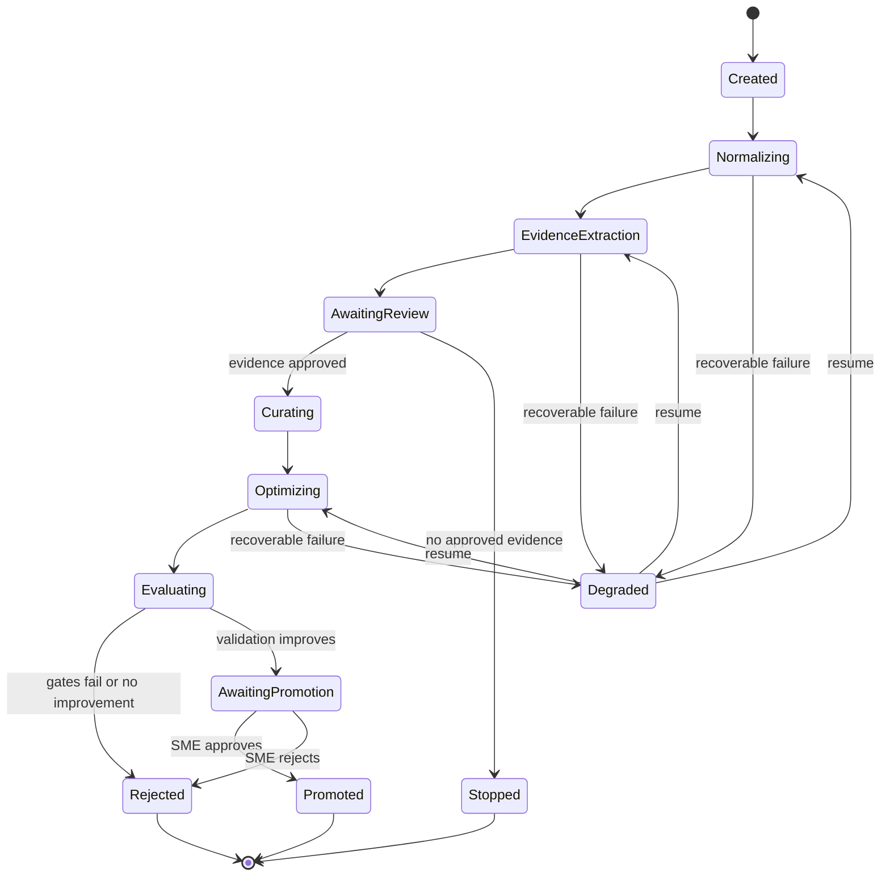

# System Architecture

## Goal

Build a continuous, evidence-driven system that learns how expert assessment
authors improve assessment-generation skills. The system produces one generic
assessment-improvement skill, then applies it to an external domain-specific
target skill such as an AWS assessment skill.

The architecture is generic because the real AWS skill is not yet in this
repository. Domain knowledge and compatibility constraints enter through
explicit profiles and manifests.

## Actors

| Actor | Responsibility |
|---|---|
| SME | Creates assessments, explains decisions, reviews extracted evidence, and approves releases |
| Learner | Provides indirect evidence about assessment comprehension |
| Evidence extractor | Converts sanitized conversations into structured candidates |
| Reviewer | Approves, rejects, or corrects evidence candidates |
| Principle curator | Maintains a useful, diverse, and well-covered principle bank |
| SkillOpt optimizer | Optimizes the compiled assessment-improvement skill |
| Assessment generator | Uses an original or evolved target skill to create assessments |
| Evaluator | Applies deterministic, LLM-assisted, and human rubrics |
| Release manager | Prepares proposals and preserves rollback points |

## Artifact Layers

### Evidence Layer

Immutable raw conversation references, normalized trajectories, sanitized
messages, evidence candidates, review decisions, and approved evidence.

### Knowledge Layer

Evidence-backed improvement principles and versioned bank candidates.

### Optimization Layer

Compiled seed skills, SkillOpt step artifacts, candidate skills, validation
scores, and the best validated improvement skill.

### Application Layer

Target-skill envelopes, complete evolved target skills, structured patches,
generated assessments, comparison results, and release proposals.

### Observability Layer

Langfuse sessions, traces, spans, generations, prompt links, scores, datasets,
experiments, cost, tokens, and latency.

## End-to-End Flow

```mermaid
sequenceDiagram
    participant Source as Conversation Sources
    participant Ingest as Ingestion
    participant Extract as Evidence Extraction
    participant SME as SME Review
    participant Bank as Principle Curator
    participant Opt as SkillOpt
    participant Target as Target Skill Runner
    participant Eval as Evaluator
    participant LF as Langfuse

    Source->>Ingest: SME and learner conversations
    Ingest->>LF: Sanitized processing traces
    Ingest->>Extract: Normalized, redacted trajectories
    Extract->>LF: Extraction generations and scores
    Extract->>SME: Evidence candidates
    SME->>Bank: Approved evidence bundle
    Bank->>LF: Add/Rewrite/Remove proposals
    Bank->>Opt: Compiled seed plus benchmark splits
    Opt->>Target: Candidate improvement skill + target fixture
    Target->>Eval: Original/evolved skills and assessments
    Eval->>Opt: Hard and soft scores
    Opt->>LF: Rollout traces and candidate scores
    Opt->>SME: Best skill and consumption report
    SME->>Target: Approved release proposal
```

## Component Design

### 1. Source Connectors

Connectors ingest conversations without imposing product logic. Initial sources
are LangSmith SME conversations and the existing local capture store. The
future learner connector implements the same canonical interface.

Required connector behavior:

- Assign a stable source record ID.
- Identify source system and source version.
- Preserve original ordering and timestamps.
- Attach persona as SME, learner, unknown, or mixed.
- Attach assessment, project, domain, and target-skill identifiers when known.
- Record consent, retention, and sensitivity metadata.
- Never overwrite the source payload.
- Calculate a content hash.

Unknown or mixed persona records are quarantined until resolved.

### 2. Normalization

Normalization produces a canonical conversation record with role-tagged
messages and stable source spans. It preserves enough provenance to cite every
extracted claim back to exact message IDs and character offsets.

Normalization is deterministic and repeatable. Running the same normalizer
version on the same source hash must produce the same output hash.

### 3. Privacy and Solution Redaction

The sanitizer:

- Removes secrets and configured PII.
- Pseudonymizes user identifiers.
- Detects learner solution attempts and answer-bearing content.
- Produces a sanitized training view.
- Produces an audit map showing which spans were removed and why.
- Never places removed learner solution text into LLM prompts or Langfuse.

The raw payload remains in the restricted source store and is referenced by
hash only.

### 4. Persona-Specific Extraction

SME and learner conversations use different prompts, schemas, and validators.

SME extraction identifies reusable assessment-authoring decisions. Learner
extraction identifies comprehension failures only. Mixed records are split
into evidence candidates by source span and routed separately.

Extraction uses a SkillLens-inspired parallel approach:

1. Extract modes or evidence from each trajectory independently.
2. Validate schema and source citations.
3. Merge related candidates hierarchically.
4. Retain conflicting candidates instead of silently collapsing them.
5. Present candidates for human review.

### 5. Evidence Review

Review states are:

- `pending`
- `approved`
- `rejected`
- `needs_revision`
- `superseded`

Review records are immutable events. A correction creates a new evidence
version linked to its predecessor. Approved evidence is never edited in place.

### 6. Learner Aggregation

Learner evidence is clustered by:

- Assessment ID and version.
- Assessment element or instruction.
- Confusion category.
- Semantic issue.
- Target learner level.

The default eligibility threshold is three distinct pseudonymous learners.
Repeated messages from the same learner count once for eligibility but may
increase severity. A critical single event can be escalated for review, but it
cannot enter optimization automatically.

### 7. Principle Distillation

Approved evidence is converted into reusable principles. A principle is valid
only if it contains:

- A recognizable failure or success mechanism.
- An executable action.
- Applicability conditions.
- Evidence citations.
- A high-risk or prohibited-action statement.
- A validation expectation.

Generic advice such as "make assessments clearer" is invalid.

### 8. Principle-Bank Curation

The curator generates candidate banks through Keep, Add, Rewrite, and Remove.
It evaluates utility, diversity, coverage, contradiction, staleness, and token
budget. It never mutates the current bank in place.

The selected bank is an input to compilation, not the production artifact.

### 9. Improvement-Skill Compilation

Compilation turns selected principles into a compact seed:

- Preserve mandatory safety and compatibility instructions.
- Consolidate related principles.
- Include failure mechanisms and concrete remedies.
- Include an explicit high-risk blacklist.
- Preserve evidence IDs in an external compilation manifest rather than
  bloating the runtime skill.
- Enforce a configured token budget.

Compilation must be deterministic for a given bank version, template version,
and compiler version.

### 10. SkillOpt Environment

The custom environment treats the compiled assessment-improvement skill as the
trainable artifact.

Each benchmark item provides:

- Current target-skill envelope.
- Domain profile.
- Approved evidence bundle or references.
- Assessment-generation brief.
- Expected invariants.
- Gold or rubric-based SME expectations.
- Target consumer configuration.

One rollout evolves the target skill, generates original and evolved
assessments, scores the difference, and persists the complete trajectory.

### 11. Target-Skill Evolution

The improvement skill returns:

- Decision: update, no change, or needs review.
- Complete evolved skill Markdown.
- Structured patch operations.
- Evidence IDs for every material edit.
- Preserved-contract report.
- Risks and uncertainties.
- Self-validation results.

The pipeline independently validates this output. It never trusts the
candidate's self-validation as proof.

### 12. Assessment Generation

Original and evolved target skills receive the same:

- Generator model.
- Assessment brief.
- Domain references.
- Tools.
- Temperature and generation parameters.
- Random seed where supported.

Paired execution reduces confounding. Multiple repetitions are used for
nondeterministic consumers when the cost budget permits.

### 13. Evaluation

Hard gates are evaluated first. A hard failure gives the rollout no release
eligibility regardless of soft-score improvements.

Soft evaluation then measures SME adaptation, quality, coverage, difficulty,
realism, clarity, maintainability, and learner-comprehension improvements.

### 14. Release Proposal

A proposal contains the exact input target version, complete evolved target,
patch, evidence bundle ID, improvement-skill version, principle-bank version,
scores, generated assessment comparisons, trace links, and rollback target.

Only an SME can approve production promotion.

## Run State Machine



## Immutable Artifact Layout

```text
runs/<run_id>/
  manifest.json
  00-input/
    source-index.json
    configuration.json
  01-normalized/
    conversations/*.json
  02-redacted/
    conversations/*.json
    redaction-audits/*.json
  03-evidence-candidates/
    sme/*.json
    learner/*.json
  04-evidence-approved/
    reviews/*.json
    bundle.json
  05-principle-candidates/
    principles/*.json
  06-bank-candidates/
    current.json
    proposals/*.json
    selection.json
  07-compiled-seed/
    SKILL.md
    compilation-manifest.json
  08-skillopt/
    config.json
    history.json
    runtime_state.json
    best_skill.md
    skills/
    steps/
  09-consumption-evaluation/
    baseline/
    candidate/
    score-matrix.json
    report.md
  10-release-candidate/
    evolved-skill.md
    patch.json
    validation.json
    proposal.md
```

Generated implementation may use equivalent SkillOpt-native names inside
`08-skillopt`, but the run manifest must index all artifacts.

## Identifiers and Hashes

Identifiers use stable prefixes:

| Entity | Example |
|---|---|
| Run | `run_20260807_01J...` |
| Conversation | `conv_01J...` |
| Evidence | `ev_sme_01J...` |
| Principle | `prn_01J...` |
| Bank | `bank_01J...` |
| Benchmark item | `item_01J...` |
| Target skill | `target_aws_...` |
| Release | `rel_01J...` |

IDs identify logical entities. SHA-256 hashes identify exact content. Both are
required because one logical entity can have many immutable versions.

## Failure and Recovery

### Recoverable Failures

- Temporary LLM/provider failure.
- Langfuse outage.
- Worker interruption.
- Partial batch completion.
- Rate limit.
- One malformed conversation in a larger batch.

Recoverable failures record an error artifact, retain completed outputs, and
resume from the first incomplete stage.

### Blocking Failures

- Source hash changed during a run.
- Missing evidence provenance.
- Learner solution leakage after redaction.
- Invalid target-skill envelope.
- Immutable target contract changed.
- Validation dataset unavailable.
- Artifact hash mismatch.

Blocking failures stop the affected item or release. They cannot be bypassed by
an LLM explanation.

## Security Boundaries

- Raw conversations are restricted to ingestion and sanitization.
- Extractors receive sanitized records.
- SkillOpt receives approved evidence only.
- Assessment generators receive no raw learner conversations.
- Langfuse receives sanitized content and safe metadata.
- Release reviewers can follow lineage to restricted evidence according to
  access policy.
- Target skill content is treated as untrusted data and delimited from system
  instructions to reduce prompt injection.

## Initial and Future Operation

### Initial SME-Only Operation

The system can operate before learner data arrives:

- Learner evidence bundle is empty and explicitly versioned.
- SME successful and corrected examples supply experience diversity.
- Learner-related scores are reported as not evaluated, not zero.
- Promotion cannot claim learner-comprehension improvement.

### Future Learner Operation

When the learner connector arrives:

- It emits the same canonical conversation type.
- The solution-boundary classifier and redactor are enabled.
- Aggregated clusters enter the existing review workflow.
- Existing benchmark and rollout contracts do not change.
- New learner-driven metrics are added to future dataset versions.

## Architecture Acceptance Criteria

- Every material change can be traced to approved evidence.
- Every LLM call can be traced to a prompt version and local artifacts.
- Every run can resume without overwriting prior output.
- Original and evolved target skills are compared under paired conditions.
- A candidate cannot pass by formatting quality alone.
- Learner solution content never enters optimization or assessment generation.
- No production promotion occurs without SME approval.
