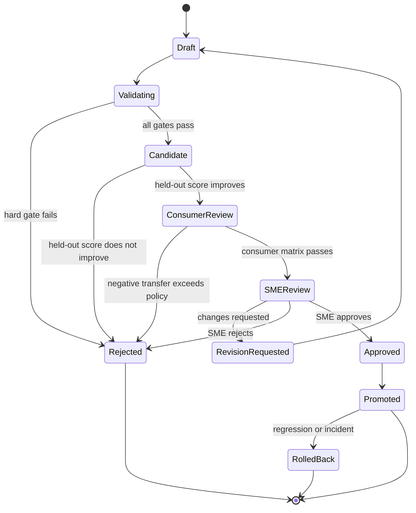

# Validation, Governance, and Rollout

## Purpose

This system changes instructions that create assessments. A poor update can
misstate domain facts, expose solutions, confuse learners, or silently reduce
assessment quality. Validation and governance are therefore part of the core
product, not post-processing.

## Validation Layers

| Layer | Question |
|---|---|
| Source validation | Is the conversation authentic, permitted, and intact? |
| Sanitization validation | Is restricted or solution-bearing content removed? |
| Evidence validation | Is the claim grounded, scoped, and approved? |
| Principle validation | Is the rule executable, bounded, and evidence-backed? |
| Bank validation | Is the bank useful, diverse, covered, and non-contradictory? |
| Evolution validation | Did the improvement skill safely update the target skill? |
| Assessment validation | Did the evolved target produce a better assessment? |
| Consumer validation | Does improvement transfer across supported targets? |
| Release validation | Is the proposal complete, traceable, reversible, and approved? |

## Hard-Gate Policy

Hard gates are non-compensatory. A higher quality score cannot offset:

- Learner solution leakage.
- PII or secret exposure.
- Invalid output schema.
- Missing evidence citations.
- Broken target-skill contracts.
- Unsupported domain claims.
- Incorrect answer keys or evaluator criteria.
- Test-set contamination.
- Artifact integrity failure.
- Missing required SME approval.

Every hard-gate result includes validator version, input artifact hashes,
boolean result, failure code, human-readable explanation, and Langfuse score
link.

## Evaluation Profiles

An evaluation profile versions:

- Hard-gate set.
- Soft-score dimensions and weights.
- LLM judge prompts and models.
- Deterministic validator versions.
- Required repetitions.
- Non-regression tolerances.
- Consumer matrix.
- Cost and latency limits.
- Promotion thresholds.

Changing any element creates a new profile. Results from different profiles
must not be compared without an explicit compatibility report.

## Deterministic Validation

Use code validators wherever possible:

- JSON and frontmatter parsing.
- Required field and section validation.
- Patch application and reconstruction.
- Immutable-section diff.
- Required tool and output contract checks.
- Citation existence and approval state.
- Hash verification.
- Duplicate and split-leakage checks.
- Prohibited-pattern and secret scans.
- Question/answer cardinality.
- Assessment blueprint counts.
- Duration and difficulty bounds when formally specified.
- Script execution in an isolated environment.

LLM judges cover only dimensions that cannot be adequately formalized.

## LLM-Assisted Evaluation

Judge prompts must:

- Receive sanitized content.
- Compare original and candidate blindly where possible.
- Use an explicit rubric with anchored score meanings.
- Cite evidence from the evaluated artifacts.
- Return structured output.
- State uncertainty.
- Avoid rewarding verbosity or surface polish.
- Be calibrated against SME labels.

Use multiple judging passes or models for high-impact subjective dimensions
when budget permits. Disagreement above a configured threshold enters human
review.

## SME Review

### Evidence review

The SME verifies:

- Extracted decision matches the source.
- Rationale is correctly interpreted.
- Applicability and exceptions are complete.
- Positive and negative examples are correctly paired.
- No confidential or solution content remains.
- The evidence is suitable for training, validation, test, or observation only.

### Release review

The SME receives:

- Original target skill.
- Complete evolved target skill.
- Structured patch.
- Evidence-to-change matrix.
- Baseline and candidate generated assessments.
- Hard-gate report.
- Per-dimension score report.
- Consumer and negative-transfer matrix.
- Known risks and evaluator disagreement.
- Cost and trace links.
- Rollback target.

The review decision is approve, reject, or request revision. Silence is never
approval.

## Test Strategy

### Unit tests

Cover:

- Canonical conversation parsing.
- Stable ordering and hashing.
- Source-span offset validation.
- Persona resolution.
- PII and secret redaction.
- Learner solution-boundary classification.
- Evidence schema parsing.
- Review-state transitions.
- Learner distinct-user aggregation.
- Principle schema and applicability.
- Bank objective calculations.
- Pareto selection and deterministic tie-break.
- Compiler section and token-budget enforcement.
- Patch reconstruction.
- Artifact safe-write behavior.
- Langfuse metadata sanitization.

### Golden extraction tests

Maintain SME-labeled conversations with expected:

- Evidence categories.
- Source spans.
- Correction pairs.
- Accepted/rejected decisions.
- Confidence bands.
- Conflict flags.

Maintain learner-labeled messages for:

- Clear comprehension issue.
- Clear solution request.
- Mixed issue and solution.
- Irrelevant conversation.
- Repeated issue from one learner.
- Repeated issue across learners.

The learner solution false-negative rate is a release hard metric.

### Contract tests

Target-skill fixtures cover:

- Minimal SKILL.md.
- Rich frontmatter.
- Required references and scripts.
- Immutable sections.
- Strict output schema.
- Tool dependencies.
- Unfamiliar section ordering.
- Unicode and long content.
- Missing or invalid manifest.

Each fixture verifies full evolved output, patch correctness, contract
preservation, and no-change behavior.

### SkillOpt adapter tests

- Loader reads each split deterministically.
- Leakage groups never cross splits.
- Every rollout result has ID, hard, soft, and extras.
- Every reflected rollout has a nonempty persisted trajectory.
- Failed evolution persists failure feedback.
- Original and evolved assessments use paired settings.
- Resume does not repeat completed artifact-producing steps.
- Test split is inaccessible during training.
- Candidate rejection preserves current best.

### Langfuse tests

- Each generation has model, prompt version, tokens, latency, and artifact IDs.
- Trace and session grouping is correct.
- Sanitized bodies are readable.
- Prohibited data is suppressed.
- Trace IDs are written to local manifests.
- Local artifacts can backfill telemetry after an outage.
- Short-lived workers flush.
- Langfuse failure does not alter artifact output.

### Adversarial tests

- Target skill contains prompt injection.
- Conversation tells extractor to ignore schema.
- Learner embeds a valid answer inside a clarity complaint.
- SME and learner roles are mislabeled.
- Evidence ID points to an unapproved record.
- Domain profile contains a conflicting policy.
- Candidate removes an immutable section.
- Candidate invents an AWS fact.
- Candidate hides solution text in references or scripts.
- Judge favors a longer but worse assessment.
- Duplicate conversations attempt to inflate support.
- Artifact file is modified after hashing.

### End-to-end scenarios

#### Scenario A: Valid SME improvement

An SME corrects an assessment instruction and explains why. Extraction,
approval, principle distillation, bank curation, SkillOpt optimization, target
evolution, paired generation, validation, and proposal all complete with full
lineage.

#### Scenario B: Learner confusion without solution

Three distinct learners report that the expected output format is unclear.
The cluster is reviewed and approved. The target skill gains clarity guidance
without adding answer steps. Downstream clarity improves.

#### Scenario C: Learner asks for solution

A learner asks for commands to complete an AWS task. The content is classified
as solution seeking, excluded, audited, and never reaches principle
distillation or Langfuse content fields.

#### Scenario D: Conflicting SME evidence

Two approved sources prescribe different difficulty behavior for different
assessment types. The system scopes both principles rather than merging them
into a false universal rule.

#### Scenario E: Candidate overfits

Training score improves while validation or one protected dimension declines.
SkillOpt rejects the candidate and retains the previous best.

#### Scenario F: Negative target transfer

The skill improves one consumer but harms another supported consumer. The
release is blocked or scoped to compatible consumers.

#### Scenario G: Langfuse unavailable

The run completes local artifacts, marks telemetry degraded, queues backfill,
and blocks final promotion until required observability is restored or waived.

#### Scenario H: No useful evidence

All evidence is rejected, redundant, or unsupported. The system produces a
documented no-change outcome rather than forcing an update.

## Dataset Governance

- Dataset versions are immutable.
- Split assignment uses assessment-family and conversation-lineage boundaries.
- Final test content is hidden from extraction prompt tuning, bank selection,
  and SkillOpt reflection.
- New production failures enter a future dataset version, never the active
  validation result retroactively.
- Synthetic fixtures are labeled and cannot establish AWS factual quality.
- Every dataset item has provenance, review state, sensitivity, and content
  hash.
- Removal requests create new dataset versions and tombstone affected items.

## Model and Prompt Governance

- Extractor, optimizer, target, and judge models are independently configured.
- Model changes trigger comparison experiments.
- Prompt files require code review.
- Langfuse labels mirror approved Git prompt versions.
- Production uses pinned versions, not uncontrolled latest versions.
- Judge changes require calibration against a stable SME-labeled dataset.
- A prompt or model that lowers grounding or leakage safety cannot be promoted.

## Promotion State Machine



## Release Package

A release package contains:

```text
release/<release_id>/
  proposal.md
  original-target-skill.md
  evolved-target-skill.md
  structured-patch.json
  evidence-change-matrix.json
  validation-report.json
  consumption-report.md
  score-matrix.json
  approvals.json
  rollback.json
  manifest.json
```

The package is immutable after approval. Any correction creates a new release
candidate.

## Rollback

Rollback metadata records:

- Promoted target version.
- Previous target version.
- Improvement-skill and bank versions.
- Release timestamp and approver.
- Deployment destination.
- Verification procedure.
- Reversal procedure.

Rollback triggers include:

- Production assessment regression.
- Incorrect domain behavior.
- Solution leakage.
- Contract incompatibility.
- Negative learner or SME incident.
- Monitoring anomaly confirmed by review.

Rollback restores the previous target skill. It does not delete the failed
release or evidence.

## Monitoring After Promotion

Track:

- Assessment-generation failure rate.
- Validator and schema failures.
- SME edit distance and manual correction categories.
- Learner comprehension issue rate.
- Solution leakage incidents.
- Target consumer performance delta.
- Cost and latency.
- Skill selection and application counts.
- Negative-transfer indicators.

Post-promotion evidence is analyzed in a future run. Production target skills
are never silently self-modified.

## Staged Rollout

### Stage 0: Documentation and schemas

Complete contracts, templates, research mapping, and acceptance criteria.

### Stage 1: Offline SME prototype

Use approved SME conversations and synthetic structural fixtures. No learner
claims and no production AWS promotion.

### Stage 2: Real AWS staging integration

Ingest real target skills through envelopes, add authoritative domain profiles,
run offline evolution, and obtain SME blind comparisons.

### Stage 3: Learner evidence shadow mode

Collect and classify learner conversations, but do not allow them to affect
optimization. Measure classifier precision and solution leakage.

### Stage 4: Reviewed learner evidence

Enable aggregated, SME-approved learner clusters in offline optimization.

### Stage 5: Proposal-only production

Generate release proposals for external target skills. SME applies or promotes
them manually.

### Stage 6: Controlled assisted promotion

Automation prepares deployment after approval, with verification and rollback.
There is still no unreviewed automatic promotion.

## Release Acceptance Criteria

- All hard gates pass.
- Validation delta is positive against the current best.
- Protected dimensions do not regress.
- Negative-transfer policy passes for supported consumers.
- Test score confirms validation without using test data for selection.
- Evidence coverage and grounding meet profile thresholds.
- Learner solution leakage is zero.
- Artifacts and Langfuse lineage are complete.
- Cost and latency remain within configured budgets.
- SME approval is recorded.
- Rollback is tested and available.

## Documentation Definition of Done

The implementation is not production ready merely because code runs. It is
ready for the next rollout stage only when:

- Corresponding tests exist and pass.
- Dataset and evaluation profiles are versioned.
- Dashboards and alerts cover the new stage.
- Reviewers can inspect evidence and output.
- Run reconstruction succeeds from artifacts.
- Security and privacy review is complete.

