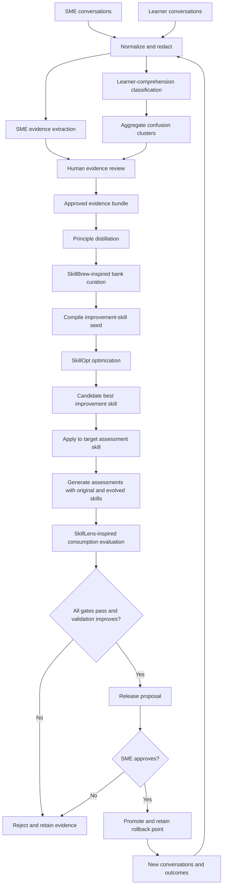

# Assessment-Skill Evolution System

## Purpose

This documentation defines the target design for evolving assessment-generation
skills from real subject matter expert (SME) and learner conversations.

The system does not directly create or solve an AWS assessment. It creates and
optimizes an **assessment-improvement skill** that can inspect an existing
assessment-generation skill, propose an evidence-backed revision, and prove
that the revised target skill produces better assessments.

The first external target is expected to be an AWS assessment skill. That skill
is not currently present in this repository, so the design uses a generic
target-skill contract and a separate AWS domain profile.

## Core Artifacts

| Artifact | Meaning | Lifecycle |
|---|---|---|
| Improvement principle | One evidence-backed rule for improving an assessment skill | Distilled and curated |
| Principle bank | Versioned collection of improvement principles | Add, rewrite, keep, or remove |
| Assessment-improvement skill | The single deployable meta-skill produced by SkillOpt | Optimized and validated |
| Domain profile | AWS-specific terminology, policies, competency model, and validators | Supplied at application time |
| Target assessment skill | Existing external skill that generates assessments | Inspected and evolved |
| Evolved target skill | Proposed replacement for the target assessment skill | SME-reviewed before promotion |
| Generated assessment | Downstream assessment produced with a target skill | Scored against quality criteria |
| Evidence bundle | Approved SME evidence and learner-comprehension evidence | Immutable input to a run |

## Terms

- **SME adaptation** means reproducing the SME's decision process, constraints,
  and quality standards. It does not mean copying the SME's wording.
- **Learner-comprehension evidence** means evidence that a learner could not
  understand the assessment instructions, terminology, expected format,
  environment, or feedback. It explicitly excludes answer generation and
  solution assistance.
- **Evolution evaluation** measures whether an improvement skill modified a
  target skill safely and with adequate evidence.
- **Consumption evaluation** measures whether the evolved target skill produces
  better assessments than the original target skill.
- **Hard gate** is a non-negotiable pass/fail requirement.
- **Soft score** measures a quality dimension and is used for comparison.
- **Promotion** means making an evolved target skill eligible for production.

## End-to-End Architecture

## Research Responsibilities

| Approach | Responsibility in this system |
|---|---|
| SkillLens | Lifecycle normalization, evidence-pool design, extraction quality dimensions, and consumption metrics |
| SkillBrew | Global curation of the principle bank using utility, diversity, and coverage |
| SkillOpt | Validation-gated optimization of one deployable assessment-improvement skill |
| Langfuse | LLM tracing, prompt linkage, experiments, scores, cost tracking, and review navigation |
| Local artifacts | Authoritative inputs, outputs, hashes, lineage, resumability, and audit history |

SkillOpt is the only optimizer dependency. SkillLens is used as a design and
evaluation reference. SkillBrew is implemented as a local, research-inspired
curator because the paper does not currently link a reusable implementation.

## Fixed Product Decisions

1. The deployable result is one domain-neutral assessment-improvement
   `best_skill.md` plus a versioned principle-bank snapshot.
2. AWS-specific behavior is supplied through a domain profile, not embedded
   permanently in the generic improvement skill.
3. New SME evidence is automatically extracted but must be approved by an SME
   before training or validation use.
4. Learner evidence is solution-redacted, aggregated across learners, and then
   approved by an SME.
5. An improvement run returns both the complete evolved target skill and a
   structured patch.
6. No target skill is promoted automatically. The system creates a proposal,
   evaluation report, and rollback point for SME approval.
7. The filesystem is the authoritative artifact store for the first
   production-capable version.
8. Langfuse is self-hosted. It receives redacted content and local artifact
   identifiers, hashes, and paths.
9. Prompts live in version-controlled files and are mirrored into Langfuse for
   tracing and experiment comparison.
10. Every intermediate transformation is persisted, including rejected
    evidence, rejected principle-bank proposals, rejected SkillOpt candidates,
    and failed release proposals.

## Reading Order

1. [Research synthesis](01-research-synthesis.md)
2. [System architecture](02-system-architecture.md)
3. [Conversation and evidence design](03-conversation-evidence-design.md)
4. [Principle-bank and SkillOpt design](04-principle-bank-and-skillopt-design.md)
5. [Artifact lineage and Langfuse](05-observability-artifacts-and-langfuse.md)
6. [Validation, governance, and rollout](06-validation-governance-and-rollout.md)
7. [Proto2 migration roadmap](07-proto2-migration-roadmap.md)
8. [Assessment-improvement skill template](templates/assessment-skill-improver/SKILL.md)
9. [Domain profile template](templates/domain-profile.md)
10. [Target-skill envelope template](templates/target-skill-envelope.md)
11. [Evolution-result template](templates/evolution-result.md)

## Current Proto2 Versus Target System

| Concern | Current Proto2 | Target |
|---|---|---|
| Primary goal | Evolve per-sandbox operating skills | Evolve an assessment-improvement meta-skill |
| Conversation classes | LangSmith and local coding agents | Explicit SME and learner personas |
| Classification | Opening-prompt similarity and LLM routing | Assessment identity, evidence type, domain, and persona |
| Learning | Direct LLM rewrite of `SKILL.md` | Principle curation followed by SkillOpt |
| Acceptance | Successful LLM output | Held-out downstream validation |
| Learner handling | Not modeled | Strict assessment-understanding filter |
| Observability | Console output and local UI | Immutable artifacts plus Langfuse |
| Deployment | Catalog served through MCP | SME-approved release with rollback |

## System Boundaries

The system must:

- Learn reusable assessment-authoring behavior from approved evidence.
- Preserve the target skill's declared compatibility contract.
- Identify where learners cannot understand an assessment.
- Demonstrate downstream improvement before proposing promotion.
- Make every decision traceable to source evidence and a versioned prompt.

The system must not:

- Solve assessments for learners.
- Use learner answers as improvement instructions.
- infer AWS facts without an authoritative domain profile or reference.
- Rewrite target skills from a single unreviewed conversation.
- Treat an aesthetically convincing skill as proof of utility.
- expose raw learner PII or solution content to optimization prompts.
- silently promote an evolved target skill.

## Definition of Success

A release candidate is successful only when:

- Every hard validation gate passes.
- The optimized improvement skill beats the seed skill on held-out validation.
- The evolved target skill beats or matches the original on all protected
  assessment dimensions and improves at least one required dimension.
- Skill utility remains positive across the supported target consumer matrix.
- Every material edit is grounded in approved evidence.
- Learner solution leakage is zero.
- An SME approves the evidence set and release proposal.
- All artifacts, prompts, traces, scores, and approvals can be reconstructed
  from their recorded identifiers and hashes.

## Primary References

- [SkillOpt repository](https://github.com/microsoft/SkillOpt)
- [SkillOpt custom benchmark guide](https://github.com/microsoft/SkillOpt/blob/main/docs/guide/new-benchmark.md)
- [SkillLens repository](https://github.com/microsoft/SkillLens)
- [SkillLens project and findings](https://microsoft.github.io/SkillLens/)
- [SkillBrew paper](https://arxiv.org/abs/2605.29440)
- [Langfuse observability concepts](https://langfuse.com/docs/observability/data-model)
- [Langfuse evaluation concepts](https://langfuse.com/docs/evaluation/core-concepts)

